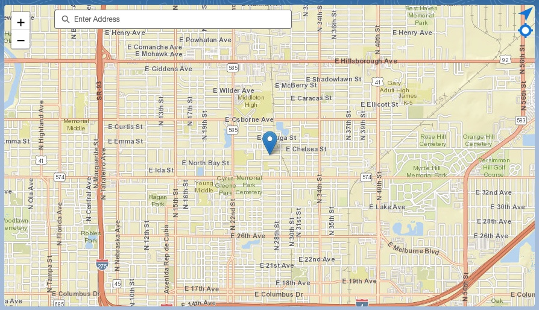
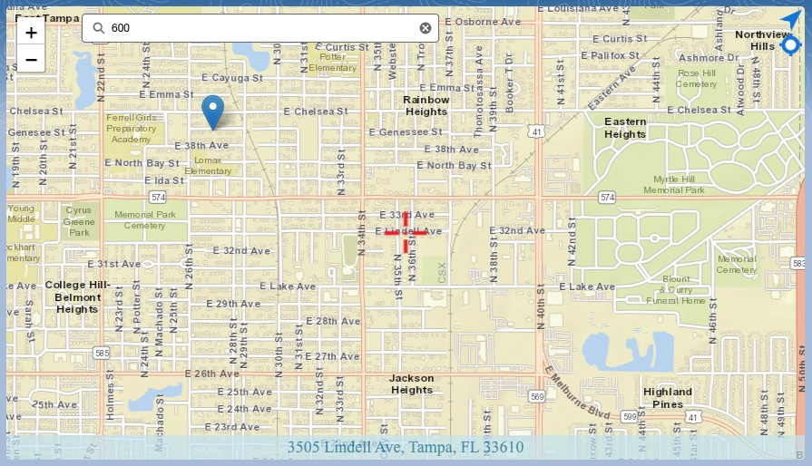
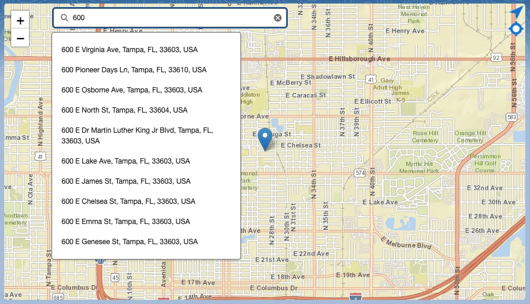

# PS2MapComponents
THIS SOFTWARE IS COVERED BY [THIS DISCLAIMER](https://raw.githubusercontent.com/thedges/Disclaimer/master/disclaimer.txt).

This repo provides new LWC based map components to be used in demos

# Installation
1. Install this repo to your target demo org using the below link.
2. For PS2RecordLocator component, assign the "PS2RecordLocator" perm set to the user(s) that will use this component.
   * Edit a page and find the "PS2 Record Locator" component in the custom LWC component list and drop on your page.

# PS2RecordLocator
Use this component to drop on record to show current location. You can move map to new location and component will do a reverse address lookup based on location of crosshair. Click on address at bottom of window to set the record lat/lng and address fields. The following is example of the map component on a record.

* Features of the component:
  - If lat/lng location already exists on record, it will center on that location
  - Move the map to new location and address will show in bottom of map. Click on address location and it will set fields on the record. Address will disappear once you have set it.
  - A "find me" icon will show in top-right of map once the browser has detected your current GPS location. This icon shows once the component captures your current lat/lng location. Just click this to move to your current location.
* The component configuration fields are:

| Parameter | Description |
|-----------|-------------|
| <b>SObject Field For Latitude</b> | SObject field that stores the latitude value |
| <b>SObject Field For Longitude</b> | SObject field that stores the longitude value |
| <b>SObject Field For Full Address</b> | SObject field that stores full address in one value |
| <b>SObject Field For Street</b> | SObject field that stores the street |
| <b>SObject Field For City</b> | SObject field that stores the city |
| <b>SObject Field For State</b> | SObject field that stores the state |
| <b>SObject Field For Postal/Zipcode</b> | SObject field that stores postal code |
| <b>Map Center Latitude</b> | Default latitude for center of map |
| <b>Map Center Longitude</b> | Default longitude for center of map |
| <b>Map Zoom Level</b> | Default map zoom level |
| <b>Map height in pixels</b> | Height of map in pixels |
| <b>Re-center on current location</b> | Re-center map on your current GPS location once the component gets your lat/lng coords |
| <b>Address auto-complete</b> | Show the address autocomplete box in upper portion of component |
